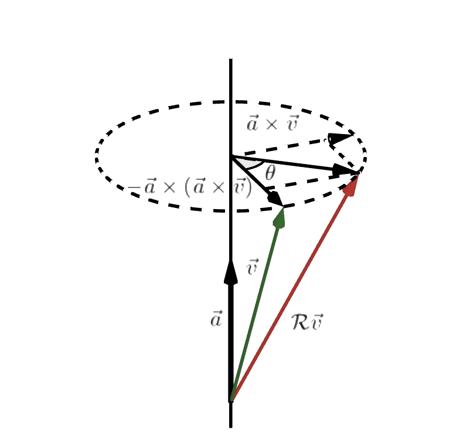

# Chapter 1
For this course, we use the ==geometric free system==, which means we mainly focus on the manipulation of $\vec v$, and only introduce coordinates when computing is needed.
## Between $\mathbb{R}^3$ and $\mathbb{E}^3$
__Q:__ What is $\mathbb{E}^3$ and $\mathbb{R}^3$?
__A:__ $\mathbb{E}^3$ is the 3-dimensional Euclidean space (vector addition and scalar multiplication obey Euclidean geometry) which is a collection of vectors, not numbers! The collection of real numbers is denoted by $\mathbb{R}$. And $\mathbb{R}^3$ can represent the Euclidean space. In short we have
$$
\vec v\in \mathbb{E}^3,v\in\mathbb{R}^3
$$

__Q:__ How is $\vec v$ related to $v$?
__A:__ As I mentioned, $\vec v$ is a geometric free vector, which means we need a frame $\mathcal{E}$(coordinates system) when describing it numeriacally. A geometric free vector, $\vec p$, can be represented as an algebric vector, $p=\begin{bmatrix}p_1\\p_2\\p_3\end{bmatrix}$,($p_1,p_2,p_3$ are real numbers), in an othornormal frame $\mathcal E = \begin{bmatrix}\vec{e_1},\vec{e_2},\vec{e_3}\end{bmatrix}$. We have 
$$
p_1 = \vec{e_1}\cdot\vec p, \,p_2 = \vec{e_2}\cdot\vec p,\,p_3 = \vec{e_3}\cdot\vec p
$$
==Simply we have==
$$
p = \mathcal E^*\vec p,\,\vec p = \mathcal E p
$$
where
$$
\mathcal E^*\vec p=\begin{bmatrix}\vec{e_1}\cdot\\\vec{e_2}\cdot\\\vec{e_3}\cdot\end{bmatrix}
\vec p$$

## Rotation in 3D space
__Q:__ What if we have multiple frames, and what is the relationship of $p_i$ for $\vec p$ in different frames?
__A:__ The reprentations of $\vec p$ in two frames $\mathcal{E}_a$ and $\mathcal{E}_b$ can be written as 
$$
p_a = \mathcal{E}_a^*\vec p,\,p_b = \mathcal{E}_b^*\vec p
$$
==and==
$$
p_a = \mathcal{E}_a^*(\mathcal{E}_b p_b)
$$
__where $\mathcal{E}_a^*\mathcal{E}_b$ is always denoted as rotation matrix $R_{ab}$__, ==further we can have==
$$
R_{ab}=\begin{bmatrix}\vec{x_a}\cdot\\\vec{y_a}\cdot\\\vec{z_a}\cdot\end{bmatrix}\begin{bmatrix}\vec{x_b}&\vec{y_b}&\vec{z_b}\end{bmatrix}=\begin{bmatrix}\vec{x_a}\cdot\vec{x_b}&\vec{x_a}\cdot\vec{y_b}&\vec{x_a}\cdot\vec{z_b}\\\vec{y_a}\cdot\vec{x_b}&\vec{y_a}\cdot\vec{y_b}&\vec{y_a}\cdot\vec{z_b}\\\vec{z_a}\cdot\vec{x_b}&\vec{z_a}\cdot\vec{y_b}&\vec{z_a}\cdot\vec{z_b}\end{bmatrix}
$$
==And $R_{ab}$ is the mapping from a vector's algebric representation in frame b to it in frame a.==

__Q:__ Now we already know how to express rotaion of a frame, with the vector fixed, how about manipulating the vector instead?
__A:__ Suppose we have $\vec v$ after some linear transform becoming $\vec w$. We can denote this geometrically
$$
\vec w = \mathcal L\vec v
$$
And if we want it algebracally
$$
w = \mathcal E^*\vec w=\mathcal E^*\mathcal L\mathcal Ev
$$
==And we denote== $\mathcal E^*\mathcal L\mathcal E$ as $L$
==For example== $\mathcal L = \vec a\times$     
We know $\vec{e_i}\cdot\vec a\times\vec{e_j}=\vec a\times\vec{e_j}\cdot\vec{e_i}=\vec a\cdot\vec{e_j}\times\vec{e_i}$
$$
\begin{bmatrix}\vec{e_1}\cdot\\\vec{e_2}\cdot\\\vec{e_3}\cdot\end{bmatrix}\vec a\times\begin{bmatrix}\vec{e_1}&\vec{e_2}&\vec{e_3}\end{bmatrix}=\begin{bmatrix}0&-a_3&a_2\\a_3&0&-a_1\\-a_2&a_1&0\end{bmatrix}=a^{\times}
$$
Also we have $(R_{ab}w_b)^\times = R_{ab}w_b^\times R_{ba}$
$$
\begin{aligned}
(R_{ab}w_b)^\times& = w_a^\times = \mathcal{E}_a^*\vec w\times\mathcal{E}_a\\&=\mathcal{E}_a^*\mathcal{E}_b\mathcal{E}_b^*\vec w\times\mathcal{E}_b\mathcal{E}_b^*\mathcal{E}_a\\
&=R_{ab}w_b^\times R_{ba}
\end{aligned}
$$
==Intuitively, if we need to do a cross product of $\vec x,\vec y$ in frame a, we can also first do it in frame b and transform the outcome to frame a.==
==Further we can easily prove that $w^\times v^\times=vw^T-(v^Tw)I_3$ and $(w^\times v)^\times=vw^T-wv^T$==
==Another example==, the relationship between $L_a,L_b$
$$
\begin{aligned}
L_a &= \mathcal{E}_a^*\mathcal L\mathcal{E}_a
\\\mathcal L &=\mathcal{E}_a\mathcal{E}_a^*\mathcal L\mathcal{E}_a\mathcal{E}_a^*\\
L_b &= \mathcal{E}_b^* \mathcal{E}_a\mathcal{E}_a^*\mathcal L\mathcal{E}_a\mathcal{E}_a^*\mathcal{E}_b = R_{ba}L_aR_{ab}
\end{aligned}
$$
This example shows how the algebrical representions of one linear transform in two frames related. And this can be understood intuitively like the last example.

__So what is $R_{ab}$ in short?__
1. $R_{ab}$ shows how the representaion of the same vector varies from $\mathcal{E}_b$ to frame $\mathcal{E}_a$.
2. Denote $\mathcal R$ as the mapping (rotation) takes $\mathcal{E}_a$ to $\mathcal{E}_b$. Then $R_{ab}$ is the representation of $\mathcal R$ in $\mathcal{E}_a$.
we have
$$
\begin{aligned}
\mathcal{E}_b &= \mathcal R\mathcal{E}_a\\
\mathcal{E}_a^*\mathcal{E}_b &=\mathcal{E}_a^* \mathcal R\mathcal{E}_a = R_{ab}
\end{aligned}
$$

3. $R_{ab}$ is the representation of $\mathcal{E}_b$ in $\mathcal{E}_a$. 
## Euler-Rodrigues Formula
__Q:__ Say we have a unit vector $\vec a$ and an angle $\theta$, so what is the $R$ that denotes a rotation along $\vec a$ with angle $\theta$?
__A:__ Denote such rotation as $\mathcal R$, and the vector $\vec v$ after rotation is denoted as $\mathcal R\vec v$ 

We can directly see from the graph that
$$
\begin{aligned}
\mathcal R\vec v&=\vec v+\vec a\times(\vec a\times\vec v)+\sin{\theta}\vec a\times\vec v-\cos{\theta}\vec a\times(\vec a\times\vec v)\\
&\mathcal R\vec v=\vec v+\sin{\theta}\vec a\times \vec v+(1-\cos{\theta})\vec a\times(\vec a\times\vec v)\\
\mathcal R&=\mathcal I+\sin{\theta}\vec a\times+(1-\cos{\theta})\vec a\times\vec a\times
\end{aligned}
$$
And represent $\mathcal R$ in a frame, we have
$$
R = I_3+\sin{\theta}a^\times+(1-\cos{\theta})(a^\times)^2
$$